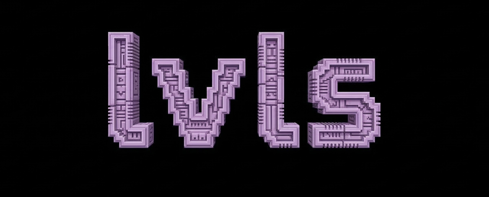

<div align="center">
  
  <br/><br/>
  <strong>Local-first, hierarchical key vault with post-quantum encryption</strong>
  <br/><br/>

  
  
  
  
  
  
  
</div>

---

**lvls** is a self-hosted personal key vault with four independent cryptographic security levels, post-quantum encryption (ML-KEM-768, NIST FIPS 203), and a lease-based machine credential system. Secrets are encrypted client-side before leaving your browser — the server stores only ciphertext.

Built for developers and operators who self-host their infrastructure and want a single, audited store for personal credentials *and* service secrets — without a SaaS subscription or cloud dependency.

---

## Table of Contents

- [How it works](#how-it-works)
- [Security architecture](#security-architecture)
- [Features](#features)
- [Workflows](#workflows)
  - [Personal vault](#workflow-personal-vault)
  - [Machine vaults & leases](#workflow-machine-vaults--leases)
  - [Offline tokens](#workflow-offline-tokens)
  - [Backup & restore](#workflow-backup--restore)
  - [Browser extension](#workflow-browser-extension)
- [Quick start](#quick-start)
- [Production deployment](#production-deployment)
- [Environment variables](#environment-variables)
- [API reference](#api-reference)
- [Project structure](#project-structure)
- [Security audit](#security-audit)
- [Known limitations](#known-limitations)
- [Roadmap](#roadmap)
- [License](#license)

---

## How it works

```
┌─────────────────────────────────────────────────────────────────────┐
│                          Your Browser                               │
│                                                                     │
│   ┌──────────┐   ┌──────────┐   ┌──────────┐   ┌──────────────┐   │
│   │  lvl  3  │   │  lvl  2  │   │  lvl  1  │   │   lvl  0     │   │
│   │ Everyday │   │  Work    │   │ Personal │   │   Critical   │   │
│   │  AES-GCM │   │ ML-KEM   │   │ ML-KEM   │   │   ML-KEM     │   │
│   │  +PBKDF2 │   │ +HKDF    │   │ +HKDF    │   │   +HKDF      │   │
│   │          │   │ +AES-GCM │   │ +AES-GCM │   │   +AES-GCM   │   │
│   └────┬─────┘   └────┬─────┘   └────┬─────┘   └──────┬───────┘   │
│        │              │               │                 │           │
│        └──────────────┴───────────────┴─────────────────┘           │
│                              │ ciphertext only                      │
└──────────────────────────────┼──────────────────────────────────────┘
                               │ HTTPS (TLS + HSTS)
┌──────────────────────────────▼──────────────────────────────────────┐
│                    lvls Server (your hardware)                      │
│                                                                     │
│   ┌─────────────────────────────────────────────────────────────┐   │
│   │  SQLite (SQLCipher) — all data encrypted at rest            │   │
│   │  secrets · auth_config · machine_vaults · leases · logs    │   │
│   └─────────────────────────────────────────────────────────────┘   │
└─────────────────────────────────────────────────────────────────────┘
```

Each level is a fully sealed compartment. Unlocking lvl3 grants zero access to lvl0, lvl1, or lvl2. A compromised session at one level cannot escalate to another.

---

## Security architecture

### The four levels

| Level | Name | Designed for | Encryption |
|-------|------|-------------|------------|
| **lvl3** | Everyday | Social profiles, Wi-Fi, subscriptions, low-value tokens | AES-256-GCM · PBKDF2-SHA256 (310k iter) |
| **lvl2** | Professional | API keys, IAM credentials, DAO access, work secrets | ML-KEM-768 · HKDF-SHA256 · AES-256-GCM |
| **lvl1** | Personal | Financial APIs, SSH keys, health data, personal identity | ML-KEM-768 · HKDF-SHA256 · AES-256-GCM |
| **lvl0** | Critical | Seed phrases, master keys, break-glass credentials | ML-KEM-768 · HKDF-SHA256 · AES-256-GCM |

### Encryption stack

```
lvl3 — PIN-based
  PIN (6+ digits)
    → PBKDF2-SHA256 (310,000 iter, 16-byte random salt per secret)
    → AES-256-GCM key
    → AES-256-GCM.encrypt(plaintext) → stored ciphertext
  Pack: base64( salt(16) ‖ iv(12) ‖ ciphertext+tag )

lvl0 / lvl1 / lvl2 — Post-quantum hybrid
  Server:
    credential → Argon2id (64 MB, 3 iter) → hash stored in DB (never reversible)

  Client (on first setup):
    credential → PBKDF2-SHA256 → AES-GCM key
    AES-GCM.encrypt(ML-KEM-768 private key) → stored in localStorage

  Encrypt:
    ML-KEM-768.encapsulate(publicKey) → { kemCiphertext, sharedSecret(32B) }
    HKDF-SHA256(sharedSecret, info="lvls-v1-aes-gcm-256") → AES-256-GCM key
    AES-256-GCM.encrypt(plaintext) → stored ciphertext
    Store: JSON { type:"hybrid", kemCiphertext, aesCiphertext }

  Decrypt:
    ML-KEM-768.decapsulate(kemCiphertext, privateKey) → sharedSecret(32B)
    HKDF-SHA256(sharedSecret) → AES-256-GCM key
    AES-256-GCM.decrypt(aesCiphertext) → plaintext
```

### Cryptographic primitives

| Primitive | Algorithm | Standard | Role |
|-----------|-----------|----------|------|
| Post-quantum KEM | ML-KEM-768 | NIST FIPS 203 | Key encapsulation for lvl0/1/2 |
| Symmetric encryption | AES-256-GCM | NIST FIPS 197 | All ciphertext storage |
| Key derivation (high-entropy) | HKDF-SHA256 | RFC 5869 | KEM shared secret → AES key |
| Password derivation | PBKDF2-SHA256 (310k) | RFC 2898 | Client-side AES key (lvl3, backup) |
| Password hashing | Argon2id (64 MB, 3 iter) | RFC 9106 | Server-side credential hashing |
| 2FA | TOTP (HMAC-SHA1) | RFC 6238 | Optional per-level and per-vault 2FA |
| Session tokens | JWT HS256 | RFC 7519 | Per-level sessions, revocable |
| Machine auth | Ed25519 | RFC 8032 | Machine identity signature verification |
| Server signing | Ed25519 (HKDF-derived) | — | Signs offline tokens |
| TOTP at rest | AES-256-GCM | — | TOTP seeds encrypted in DB |
| DB encryption | SQLCipher (AES-256-CBC) | — | Full database encryption at rest |

### Security controls

| Control | Implementation |
|---------|---------------|
| Rate limiting | DB-persisted — 5 failures / 15 min per IP. Survives restarts. |
| Per-level lockout | 5 wrong credentials locks that level for 15 min, independently of rate limiter |
| TOTP replay prevention | `used_totps` table — rejects any code reused within its 90-second validity window |
| Token revocation | `revoked_tokens` table checked on every authenticated request |
| Auto-lock | Wipes session tokens and KEM private keys from memory after 5 min inactivity |
| CORS | Restricted to `127.0.0.1`, `localhost`, and optionally one pinned extension ID |
| CSP | `default-src 'self'` — blocks external resource loading |
| Security headers | HSTS, `X-Frame-Options: DENY`, `X-Content-Type-Options`, `Referrer-Policy: no-referrer` |
| Privilege isolation | Auth at level N cannot access secrets above clearance N |
| Audit log | All auth events, secret mutations, TOTP changes, and lease events logged with session ID |
| Request body limit | 16 KB global; 50 MB for backup/restore endpoints |
| Server binding | `127.0.0.1` by default — not reachable from LAN without explicit `HOST` override |

See [SECURITY.md](SECURITY.md) for the full threat model and vulnerability disclosure policy.

---

## Features

### Personal vault
- **4 independent clearance levels** — separate credential, ML-KEM keypair, JWT, and session TTL per level
- **Post-quantum encryption** — ML-KEM-768 hybrid (FIPS 203) for lvl0/1/2, resistant to harvest-now-decrypt-later
- **Client-side encryption** — server never sees plaintext; DB contains only ciphertext
- **TOTP 2FA** — optional per level, RFC 6238 compliant, seeds AES-256-GCM encrypted at rest
- **Built-in authenticator** — store TOTP seeds, generate live 6-digit codes with countdown timer
- **Secret folders** — organise secrets into collapsible groups
- **Auto-lock** — wipes session and KEM private keys from memory after 5 min inactivity
- **Configurable session TTL** — per level: 15 min to 24 hours
- **Audit log** — tamper-evident session log, filterable by level and action

### Machine vaults & leases
- **Machine vaults** — isolated credential stores for services, VMs, and CI/CD pipelines
- **Ed25519 machine identities** — cryptographic identity registration per machine
- **Vault grants** — role-based access control with max TTL and optional secret key scoping
- **Lease-based access** — time-limited credentials with grace period, refresh, and revocation
- **Lease audit log** — full event trail (issued, refreshed, revoked, expired, accessed) with source IP
- **Blind classification** — ML-KEM encrypted secrets the server can never decrypt
- **Cached classification** — AES-256-GCM server-encrypted secrets for high-throughput access

### Offline tokens
- **Air-gapped credential delivery** — ML-KEM-768 encrypted token bundles for offline machines
- **Ed25519 server signature** — clients verify token authenticity without a network call
- **TTL-bound** — tokens carry an expiry the client enforces
- **Deterministic keypair from TOTP** — machines can regenerate ML-KEM keypair from TOTP seed; no key storage required

### Backup & restore
- **Encrypted export** — full vault dump (secrets, auth config, machine vaults) as a `.lvls` file
- **AES-256-GCM with PBKDF2** — backup passphrase is independent of vault credentials
- **Transactional restore** — atomic restore with two-phase confirmation; stats returned on success
- **lvl0-gated** — backup and restore require the highest clearance level

### Browser extension (Chrome / Edge MV3)
- **Form detection** — automatically finds login forms on any site
- **Fill badge injection** — injects an **lvl** badge next to password fields
- **Auto-fill** — opens vault popup, authenticates, and fills matching credentials
- **Domain matching** — filters secrets by the current site hostname
- **CORS-pinned** — restricted to your specific extension ID

### Infrastructure
- **SQLCipher DB** — full database encryption at rest (`LVLS_DB_KEY`)
- **TLS** — HTTPS with HSTS; auto-detects `cert.pem`/`key.pem` on startup
- **Guided onboarding** — step-by-step setup wizard on first run
- **Docker** — multi-stage production build
- **Systemd** — production service file included

---

## Workflows

### Workflow: Personal vault

```
First run
─────────
Browser                              lvls Server
   │                                      │
   │── GET /api/auth/is-setup ──────────► │
   │◄── { configured: false } ────────── │
   │                                      │
   │  [Onboarding wizard launches]        │
   │                                      │
   │── POST /api/auth/bootstrap ─────────►│  Argon2id(PIN) → DB
   │     { pin }                          │  KEM keypair generated client-side
   │◄── { success } ──────────────────── │  Public key registered server-side
   │                                      │  Private key AES-encrypted → localStorage

Unlock (subsequent visits)
──────────────────────────
Browser                              lvls Server
   │                                      │
   │  User enters credential + TOTP       │
   │                                      │
   │── POST /api/auth/unlock ────────────►│  1. Argon2id verify credential
   │     { level, credential, totp }      │  2. Check per-level lockout
   │                                      │  3. Check rate limiter
   │                                      │  4. Verify TOTP (+ replay check)
   │◄── { token, kemPublicKey } ──────── │  5. Issue JWT (level, sessionId, TTL)
   │                                      │
   │  PBKDF2(credential) → AES key        │
   │  AES.decrypt(localStorage key)       │
   │    → ML-KEM private key in memory    │

Read a secret
─────────────
Browser                              lvls Server
   │                                      │
   │── GET /api/secrets ─────────────────►│  Returns encrypted blobs only
   │    Authorization: Bearer <jwt>        │  (server never has plaintext)
   │◄── [ { id, name, encrypted_value } ]─│
   │                                      │
   │  ML-KEM.decapsulate(kemCt, privKey)  │
   │    → sharedSecret                    │
   │  HKDF(sharedSecret) → AES key        │
   │  AES.decrypt(aesCt) → plaintext      │
   │                                      │
   │  [Plaintext shown in UI, never sent] │

Write a secret
──────────────
Browser                              lvls Server
   │                                      │
   │  ML-KEM.encapsulate(pubKey)          │
   │    → { kemCt, sharedSecret }         │
   │  HKDF(sharedSecret) → AES key        │
   │  AES.encrypt(plaintext) → aesCt      │
   │                                      │
   │── POST /api/secrets ────────────────►│  Stores ciphertext blob
   │    { name, level,                    │  No plaintext ever received
   │      encrypted_value:                │
   │       { kemCt, aesCt } }            │
   │◄── { id } ───────────────────────── │
```

---

### Workflow: Machine vaults & leases

```
Setup (admin, done once)
────────────────────────
Admin UI                             lvls Server
   │                                      │
   │── POST /api/machine/vaults ─────────►│  Create vault record
   │     { name, description, ttl }       │
   │◄── { id } ───────────────────────── │
   │                                      │
   │  ML-KEM keypair generated (client)   │
   │── PUT /api/machine/vaults/:id/kem ──►│  Store public key
   │── POST /api/machine/vaults/:id/secrets►  Add secrets (blind or cached)
   │── POST /api/admin/grants ───────────►│  Grant machine access (+ scoping)

Machine identity registration (done once per machine)
──────────────────────────────────────────────────────
Machine                              lvls Server
   │                                      │
   │  Generate Ed25519 keypair            │
   │  Generate ML-KEM keypair             │
   │                                      │
   │── POST /api/machine/identities ─────►│  Register public keys
   │     { machine_id,                    │
   │       ed25519_public_key,            │
   │       kem_public_key }               │
   │◄── { registered } ──────────────────│

Lease request (at service startup / credential renewal)
────────────────────────────────────────────────────────
Machine                              lvls Server
   │                                      │
   │  timestamp = Date.now()              │
   │  sig = Ed25519.sign(                 │
   │    "lvls:{vaultId}:{machineId}:{ts}" │
   │    , privateKey)                     │
   │                                      │
   │── POST /api/machine/vaults/:id/request►  1. Ed25519.verify(sig, pubKey)
   │     { machine_id, timestamp, sig }    │  2. Check vault grant
   │                                      │  3. Enforce scoped_keys if set
   │                                      │  4. Issue lease (TTL, grace period)
   │◄── { lease_id, secrets, expires_at }─│  5. Log to lease_audit
   │                                      │
   │  [Machine uses secrets for TTL]      │
   │                                      │
   │── POST /api/machine/leases/:id/refresh► Re-authenticate → extend TTL
   │── DELETE /api/machine/leases/:id ───►│  Explicit revoke on shutdown

Lease lifecycle
───────────────
  issued → active ──────────────────────────► revoked  (explicit)
                  │                        │
                  └──► grace ──────────────► expired  (TTL elapsed)
                         (short window for
                          renewal without
                          re-authentication)
```

---

### Workflow: Offline tokens

For air-gapped machines that cannot reach the lvls server at runtime.

```
Token issuance (requires network, done in advance)
────────────────────────────────────────────────────
Machine                              lvls Server
   │                                      │
   │  sig = Ed25519.sign(...)             │
   │── POST /api/machine/vaults/:id/      │
   │        offline-token ───────────────►│  1. Verify Ed25519 sig
   │     { machine_id, timestamp,         │  2. Fetch secrets (respect scoping)
   │       sig, ttl_seconds }             │  3. ML-KEM.encapsulate(machineKemPub)
   │                                      │       → { kemCt, sharedSecret }
   │                                      │  4. HKDF(sharedSecret,
   │                                      │       info="lvls-offline-token-v1")
   │                                      │       → AES-256-GCM key
   │                                      │  5. AES.encrypt(secrets payload)
   │                                      │  6. Ed25519.sign(kemCt.aesCt)
   │                                      │       using server signing key
   │◄── { kem_ciphertext, aes_ciphertext, │
   │      server_signature,               │
   │      server_ed25519_public_key,      │
   │      expires_at } ──────────────────│
   │                                      │
   │  [Store token to file/env]           │

Token use (fully offline)
──────────────────────────
Machine (no network)
   │
   │  Ed25519.verify(sig, serverPubKey)   ← reject if invalid
   │  ML-KEM.decapsulate(kemCt, privKey) → sharedSecret
   │  HKDF(sharedSecret, info="lvls-offline-token-v1") → AES key
   │  AES.decrypt(aesCt) → { secrets, expires_at }
   │  Check expires_at → reject if expired
   │  [Use secrets — no server contact needed]
```

---

### Workflow: Backup & restore

```
Export (requires lvl0)
───────────────────────
Browser                              lvls Server
   │                                      │
   │  [User enters backup passphrase]     │
   │── POST /api/vault/backup ───────────►│  1. Dump all tables to JSON
   │    Authorization: Bearer <lvl0 jwt>  │     (secrets, auth_config,
   │    { passphrase }                    │      machine_vaults, machine_secrets,
   │                                      │      machine_identities, vault_grants)
   │                                      │  2. PBKDF2-SHA256(passphrase, salt,
   │                                      │       310k iter) → AES-256-GCM key
   │                                      │  3. AES-256-GCM.encrypt(JSON payload)
   │                                      │  4. Pack:
   │                                      │     LVLS(4) ‖ v1(1) ‖ salt(16)
   │                                      │     ‖ iv(12) ‖ tag(16) ‖ ciphertext
   │◄── { bundle: base64 } ─────────────│
   │                                      │
   │  [Browser triggers .lvls download]   │

Restore (requires lvl0)
────────────────────────
Browser                              lvls Server
   │                                      │
   │  [User selects .lvls file]           │
   │  [Two-phase confirm in UI]           │
   │── POST /api/vault/restore ──────────►│  1. Validate LVLS magic + version
   │    Authorization: Bearer <lvl0 jwt>  │  2. PBKDF2 derive key from passphrase
   │    { bundle, passphrase }            │  3. AES-GCM.decrypt → JSON payload
   │                                      │  4. Validate structure
   │                                      │  5. Transaction:
   │                                      │     DELETE all existing rows
   │                                      │     INSERT all backup rows
   │◄── { success, stats } ─────────────│
```

---

### Workflow: Browser extension

```
Page load
──────────
Content script                       lvls Server
   │                                      │
   │  Scan DOM for <input type="password">│
   │  Inject lvl badge next to field      │
   │                                      │
   User clicks badge
   │                                      │
   │  Open extension popup                │
   │── GET /api/secrets/by-domain ───────►│  Filter by current hostname
   │    { domain: "github.com" }          │
   │◄── [ encrypted credential blobs ] ──│
   │                                      │
   │  ML-KEM.decapsulate → shared secret  │
   │  AES.decrypt → { username, password }│
   │                                      │
   │  Inject username + password          │
   │    into detected form fields         │
```

---

## Quick start

### Prerequisites

- Node.js 22+
- npm 9+

### 1. Clone and install

```bash
git clone https://github.com/dhvr-era/lvls-key-vault.git
cd lvls-key-vault
npm install
```

### 2. Configure environment

```bash
cp .env.example .env
```

Generate strong secrets:

```bash
node -e "console.log('JWT_SECRET='    + require('crypto').randomBytes(32).toString('hex'))"
node -e "console.log('TOTP_ENC_SECRET=' + require('crypto').randomBytes(32).toString('hex'))"
node -e "console.log('LVLS_DB_KEY='   + require('crypto').randomBytes(32).toString('hex'))"
```

Minimum `.env`:

```env
JWT_SECRET=<64-char hex>
TOTP_ENC_SECRET=<64-char hex>
LVLS_DB_KEY=<64-char hex>
PORT=5000
HOST=127.0.0.1
```

### 3. Generate TLS certificates

**mkcert** (trusted local CA — no browser warning):

```bash
mkcert -install
mkcert -cert-file cert.pem -key-file key.pem 127.0.0.1 localhost
```

**OpenSSL** (self-signed — browser warns once):

```bash
openssl req -x509 -newkey rsa:4096 -keyout key.pem -out cert.pem \
  -sha256 -days 825 -nodes -subj "/CN=lvls" \
  -addext "subjectAltName=IP:127.0.0.1,DNS:localhost"
```

### 4. Start

```bash
# Development (Vite HMR + tsx)
npm run dev

# Production
NODE_ENV=production npx tsx server.ts
```

Open `https://127.0.0.1:5000`. The onboarding wizard launches automatically on first run.

### 5. First-run onboarding

| Step | What happens |
|------|-------------|
| Welcome | Overview of the four levels |
| Create lvl3 PIN | 6+ digits — your vault entry point |
| Configure lvl2/1/0 | Set passphrases, or skip and configure later in Settings |
| Enter vault | JWT issued, ML-KEM keypair generated and stored |

---

## Production deployment

### Systemd (recommended for VPS)

```bash
# Copy and edit the service file
cp lvls.service /etc/systemd/system/lvls.service
# Set WorkingDirectory and EnvironmentFile to your paths

systemctl daemon-reload
systemctl enable --now lvls
systemctl status lvls
```

### Docker

```bash
docker compose up -d
docker compose logs -f
```

The compose file binds `127.0.0.1:5000:5000`. Mount `.env`, `cert.pem`, `key.pem`, and `lvls.db` as volumes.

### Security hardening checklist

```bash
# Strict file permissions
chmod 600 .env key.pem cert.pem lvls.db

# Run as a non-root user (edit lvls.service)
useradd -r -s /bin/false lvls
chown -R lvls:lvls /opt/lvls-key-vault

# Set your browser extension ID (prevents CORS from other extensions)
echo "EXTENSION_ID=your_extension_id_here" >> .env

# Rotate secrets annually or after any suspected exposure
node -e "console.log(require('crypto').randomBytes(32).toString('hex'))"
```

### Browser extension

1. Open `chrome://extensions`
2. Enable **Developer mode**
3. **Load unpacked** → select the `extension/` folder
4. Copy the **Extension ID** shown
5. Set `EXTENSION_ID=<id>` in `.env` and restart lvls

---

## Environment variables

| Variable | Required | Default | Description |
|----------|----------|---------|-------------|
| `LVLS_DB_KEY` | **Yes** | — | SQLCipher database encryption key. 32-byte hex. Server refuses to start without it. Also derives the server Ed25519 signing key and machine vault cache keys. |
| `JWT_SECRET` | **Yes** | ephemeral | JWT signing secret. 32-byte hex. If unset, sessions are invalidated on restart. |
| `TOTP_ENC_SECRET` | **Yes** | derived | AES key for encrypting TOTP seeds at rest. Independent of `JWT_SECRET`. |
| `PORT` | No | `5000` | Server port. |
| `HOST` | No | `127.0.0.1` | Bind address. Set to a Tailscale IP for remote access over your mesh. |
| `EXTENSION_ID` | Recommended | — | Chrome extension ID. Restricts CORS to your extension only. |
| `NODE_ENV` | No | `development` | Set to `production` to serve the built `dist/` instead of Vite dev server. |

---

## API reference

### Authentication

| Method | Route | Auth | Description |
|--------|-------|------|-------------|
| GET | `/api/health` | None | Server health check |
| GET | `/api/auth/is-setup` | None | Returns whether any levels are configured |
| POST | `/api/auth/bootstrap` | Rate limited¹ | First-time lvl3 PIN setup |
| GET | `/api/auth/status` | lvl3+ | Configured levels, TOTP state, session TTLs |
| POST | `/api/auth/unlock` | Rate limited | Authenticate → JWT |
| POST | `/api/auth/logout` | lvl3+ | Revoke current session |
| POST | `/api/auth/setup` | lvl3+ | Set or update a level credential |
| PUT | `/api/auth/session-ttl/:level` | lvl3+ | Update session TTL for a level |

### KEM keys

| Method | Route | Auth | Description |
|--------|-------|------|-------------|
| GET | `/api/auth/kem-key/:level` | lvl3+ | Retrieve ML-KEM-768 public key for level |
| PUT | `/api/auth/kem-key/:level` | lvl3+ | Register ML-KEM-768 public key for level |

### TOTP

| Method | Route | Auth | Description |
|--------|-------|------|-------------|
| POST | `/api/auth/totp/setup/:level` | lvl3+ | Generate TOTP secret + otpauth URI |
| POST | `/api/auth/totp/confirm/:level` | lvl3+ | Confirm and activate TOTP |
| POST | `/api/auth/totp/disable/:level` | lvl3+ | Disable TOTP for a level |

### Personal secrets

| Method | Route | Auth | Description |
|--------|-------|------|-------------|
| GET | `/api/secrets` | lvl3+ | List secrets accessible at current clearance |
| POST | `/api/secrets` | lvl3+ | Create encrypted secret |
| GET | `/api/secrets/:id` | lvl3+ | Retrieve single secret |
| PUT | `/api/secrets/:id` | lvl3+ | Update secret metadata |
| DELETE | `/api/secrets/:id` | lvl3+ | Delete secret |
| GET | `/api/secrets/by-domain` | lvl3+ | Domain-matched secrets (extension) |

### Machine vaults (admin)

| Method | Route | Auth | Description |
|--------|-------|------|-------------|
| POST | `/api/machine/vaults` | lvl3+ | Create machine vault |
| GET | `/api/machine/vaults` | lvl3+ | List machine vaults |
| GET | `/api/machine/vaults/:id` | lvl3+ | Get vault details |
| DELETE | `/api/machine/vaults/:id` | lvl3+ | Delete machine vault |
| PUT | `/api/machine/vaults/:id/kem-key` | lvl3+ | Register vault ML-KEM public key |
| GET | `/api/machine/vaults/:id/kem-key` | lvl3+ | Retrieve vault ML-KEM public key |
| POST | `/api/machine/vaults/:id/secrets` | lvl3+ | Add secret to vault |
| GET | `/api/machine/vaults/:id/secrets` | lvl3+ | List vault secrets (names only) |
| DELETE | `/api/machine/vaults/:id/secrets/:secretId` | lvl3+ | Delete vault secret |
| POST | `/api/machine/vaults/:id/totp/setup` | lvl3+ | Generate vault TOTP secret |
| POST | `/api/machine/vaults/:id/totp/confirm` | lvl3+ | Activate vault TOTP |

### Machine identity & lease

| Method | Route | Auth | Description |
|--------|-------|------|-------------|
| POST | `/api/machine/identities` | Rate limited | Register Ed25519 + ML-KEM public keys |
| GET | `/api/machine/server-key` | None | Server Ed25519 public key (offline token verification) |
| POST | `/api/machine/vaults/:id/request` | Rate limited | Issue lease (Ed25519 or TOTP gated) |
| POST | `/api/machine/vaults/:id/offline-token` | Rate limited | Issue offline token (Ed25519 required) |
| DELETE | `/api/machine/leases/:id` | Rate limited | Revoke lease |
| POST | `/api/machine/leases/:id/refresh` | Rate limited | Refresh lease TTL |
| GET | `/api/machine/leases/:id/status` | Rate limited | Check lease status |

### Admin

| Method | Route | Auth | Description |
|--------|-------|------|-------------|
| GET | `/api/admin/leases` | lvl3+ | List all active leases |
| POST | `/api/admin/leases/revoke-all` | lvl3+ | Revoke all leases |
| GET | `/api/admin/lease-audit` | lvl3+ | Lease audit log |
| GET | `/api/admin/grants` | lvl3+ | List vault grants |
| POST | `/api/admin/grants` | lvl3+ | Create vault grant |
| DELETE | `/api/admin/grants/:id` | lvl3+ | Delete grant |
| POST | `/api/admin/machine/vaults/:id/offline-token` | lvl3+ | Admin-issued offline token |
| GET | `/api/admin/machine-identities` | lvl3+ | List machine identities |
| DELETE | `/api/admin/machine-identities/:machineId` | lvl3+ | Delete machine identity |

### Vault

| Method | Route | Auth | Description |
|--------|-------|------|-------------|
| POST | `/api/vault/backup` | **lvl0** | Export AES-256-GCM encrypted `.lvls` bundle |
| POST | `/api/vault/restore` | **lvl0** | Restore from `.lvls` bundle (transactional) |
| DELETE | `/api/vault/nuke` | **lvl0** | Irreversibly wipe all vault data |
| GET | `/api/logs` | lvl3+ | Session audit log |

¹ Bootstrap is only callable when zero levels are configured.

---

## Project structure

```
lvls-key-vault/
├── server.ts                  Express API — auth, secrets, machine vaults,
│                               leases, offline tokens, backup/restore, DB init
├── src/
│   ├── App.tsx                React SPA — all UI, onboarding, vault, machines,
│   │                           settings, backup/restore, nuke
│   ├── lib/crypto.ts          Client-side crypto library
│   │                           AES-256-GCM (PBKDF2, HKDF), ML-KEM-768,
│   │                           hybridEncrypt/Decrypt, offline token decryption
│   ├── types.ts               TypeScript interfaces (Secret, SessionLog)
│   └── index.css              Global styles + Tailwind v4 theme
├── extension/
│   ├── manifest.json          Chrome MV3 manifest
│   ├── background.js          Service worker — token management, API proxy
│   ├── content.js             Form detection, badge injection
│   └── popup.html / popup.js  Auth UI, credential display, client-side decrypt
├── public/
│   └── logo.png               Application logo
├── Dockerfile                 Multi-stage production build
├── docker-compose.yml         Production compose (127.0.0.1 bind, volume mounts)
├── .env.example               Environment variable template with documentation
├── SECURITY.md                Threat model, key management, vulnerability policy
└── LICENSE                    MIT
```

---

## Security audit

Full [OWASP ASVS v4.0 Level 3](https://owasp.org/www-project-application-security-verification-standard/) audit performed against this codebase. ASVS Level 3 is the highest tier, designed for high-value and high-assurance applications.

| Metric | Result |
|--------|--------|
| Controls assessed | 142 |
| Pass | 121 (85%) |
| ASVS level | 3 (highest) |
| Critical findings | 0 |
| High findings | 0 |
| npm audit CVEs | 0 |

All findings were remediated prior to publication.

---

## Known limitations

| Item | Detail |
|------|--------|
| Self-signed TLS | Use mkcert for a trusted local CA to avoid browser warnings |
| localStorage | ML-KEM private keys stored encrypted in browser localStorage. XSS on localhost could access the encrypted blob — no Web Crypto HSM alternative is currently available in browsers |
| No FIDO2 | Hardware security key support not yet implemented |
| SQLite only | Single-file DB, no replication. Designed for personal and small-team use |
| Chrome extension only | Firefox and Safari ports planned |
| TOTP SHA-1 | RFC 6238 uses HMAC-SHA1 — compatible with all authenticator apps; not practically exploitable in the HOTP context |
| aes-cached machine secrets | Cached machine secrets are re-encrypted on restore using the current `LVLS_DB_KEY`. Restoring to a new server with a different key requires re-adding cached secrets |

---

## Roadmap

- [x] Post-quantum encryption (ML-KEM-768, FIPS 203)
- [x] Machine vaults with Ed25519 identity and lease-based access
- [x] Offline tokens for air-gapped environments
- [x] Encrypted backup & restore (`.lvls` bundle, AES-256-GCM)
- [x] OWASP ASVS Level 3 audit
- [ ] Firefox and Safari extension ports
- [ ] FIDO2 / WebAuthn hardware key support
- [ ] Multi-user / team vaults with per-member ML-KEM encryption
- [ ] Mobile companion app (React Native)
- [ ] Encrypted vault sync between instances

---

## License

MIT — see [LICENSE](LICENSE)
